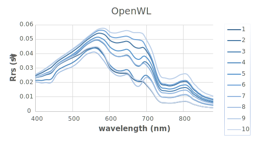
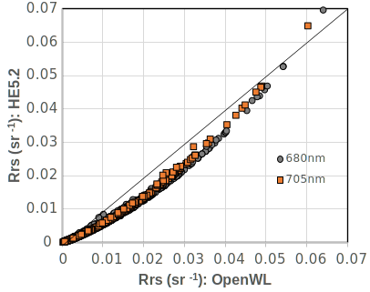
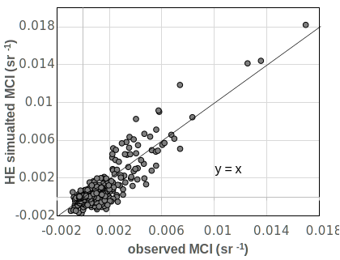
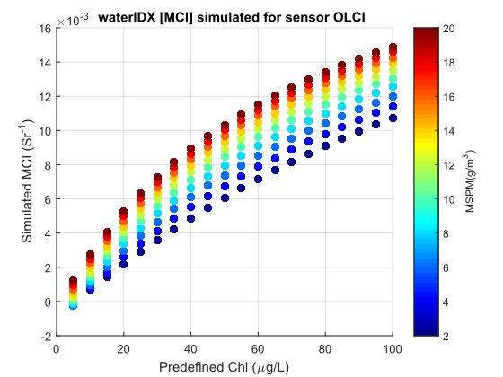
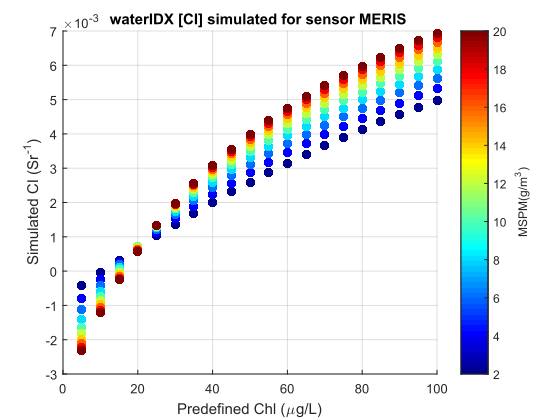
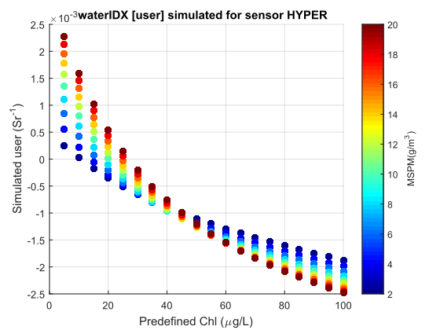

# Intro
Open Water&Light: this repository includes some water-and-light interaction related algorithm implementation.

## 1. Rrs simulation with given IOPs
The implementation of water-leaving raidance (Rrs) simulation as used in: 
- [Zeng C, Binding C. The effect of mineral sediments on satellite chlorophyll-a retrievals from line-height algorithms using red and near-infrared bands. Remote Sensing. 2019;11(19). doi:10.3390/rs11192306](https://www.mdpi.com/2072-4292/11/19/2306)

It uses a very simplified light and water interactcion empricical model:  `Rrs = f *  bb / (a + bb)`,  which does not count the impact of wind speed, temperature, etc. It was implemented in Matlab 2017b licensed to ECCC. should be compatible to versions>=2015b.

The purpose of this package is for fast computation and analyze the trend with change IOP (e.g., chl concentration); for a more strict simulation, please use [HydroLight/Ecolight  by Mobley, et al](https://www.sequoiasci.com/product/hydrolight/)

To simulate Rrs, use [`OpenLW_simu_Rrs_from_IOP.m`](OpenLW_simu_Rrs_from_IOP.m), such as:
```
>> Rrs=OpenLW_simu_Rrs_from_IOP(0.1:5:20.1,1:10);
====finish Rrs simulation, result written to:OpenLW_simu_Rrs_from_IOP_LELW_chl20_mspm10_cdom0.994.csv====
>> Rrs=OpenLW_simu_Rrs_from_IOP(0.1:5:20.1,1:10,[0.494,0.994],'bAB',false,'bSave',true,'waterIOP','waterIOP_SmithandBaker.txt','IOPname','LakeErie','wavelength',400:100:800);
====finish Rrs simulation, result written to:OpenLW_simu_Rrs_from_IOP_LakeErie_chl20_mspm10_cdom0.994.csv====
>> help OpenLW_simu_Rrs_from_IOP   %show the help info
```

a comparison of Rrs derived from OpenWL and Ecolight on some test data as follows,
Rrs_HE_Ecolight   |  Rrs_OpenWL		|Rrs_OpenWL_vs_Ecolight_scatter          |  WaterIdx_insitu_vs_simulation
:-------------------------:|:-------------------------:|:-------------------------:|:-------------------------:
  |   | | 

To simulate line-height water indexes for a specific sensor, use [`Simu_water_index.m`](Simu_water_index.m), such as:
```
>> Simu_water_index    %use all default arguments as MCI index, over OCLI sensor
====finish sensor water index simulation, result written to:./TestData/OpenLW_simu_waterIDX_MCI_of_sensor_OLCI.csv====
>> Simu_water_index('sensor','MERIS','waterIDX','CI')  %same as CI model
====finish sensor water index simulation, result written to:./TestData/OpenLW_simu_waterIDX_CI_of_sensor_MERIS.csv====
>> Simu_water_index('sensor','HYPER','waterIDX','user','designed_bands',[665, 674, 753])  %same as FLH model
====finish sensor water index simulation, result written to:./TestData/OpenLW_simu_waterIDX_user_of_sensor_HYPER.csv====
>> help Simu_water_index      %show the help info
--------------------------------------------------------------------------------------------------------------------------
```
and simulation result of the above 3 examples are:
Water index MCI            |  Water index CI              |  Water index FLH(user-define) 
:-------------------------:|:-------------------------:|:-------------------------:
 |  |   

---
## 2. [QAA](https://www.ioccg.org/groups/software.html)
implemented in python
TBC
