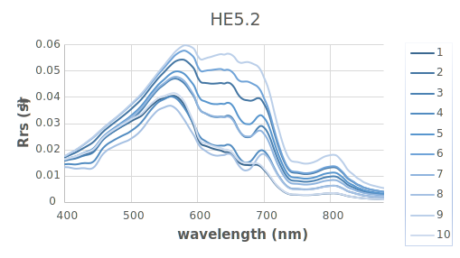

##### Table of Contents  
[1. Rrs simulation with given IOPs [MATLAB]](#Rrs_simu)  
[2. QAA6 [python]](#QAA)  

### Intro
Open Water&Light: this repository implements some water-and-light interaction algorithms in ocean optics and remote sensing.

<a name="Rrs_simu"/>

## 1. Rrs simulation with given IOPs
Simulate water-leaving radiance (Rrs) as used in: 
- [Zeng C, Binding C. The effect of mineral sediments on satellite chlorophyll-a retrievals from line-height algorithms using red and near-infrared bands. Remote Sensing. 2019;11(19). doi:10.3390/rs11192306](https://www.mdpi.com/2072-4292/11/19/2306)

It uses a simplified water and light interaction empirical  model:  `Rrs = f/PI *  bb/(a + bb)` according to: Albert, A. and C. D. Mobley (2003)Optics Express. It does not count the impact of wind speed, temperature, etc. It was implemented in Matlab 2017b licensed to ECCC. should be compatible to versions>=2015b.

The purpose of this package is for fast computation and analysis with changing IOPs (e.g., chl concentration); for a stricter simulation, please consider [HydroLight/Ecolight](https://www.sequoiasci.com/product/hydrolight/) by Mobley, et al.

To simulate Rrs, use [`OpenWL_simu_Rrs_from_IOP.m`](OpenWL_simu_Rrs_from_IOP.m), examples:
```
>> Rrs=OpenWL_simu_Rrs_from_IOP(0.1:5:20.1,1:10);
====finish Rrs simulation, result written to:OpenWL_simu_Rrs_from_IOP_LELW_chl20_mspm10_cdom0.994.csv====
>> Rrs=OpenWL_simu_Rrs_from_IOP(0.1:5:20.1,1:10,[0.494,0.994],'bAB',false,'bSave',true,'waterIOP','waterIOP_SmithandBaker.txt','IOPname','LakeErie','wavelength',400:100:800);
====finish Rrs simulation, result written to:OpenWL_simu_Rrs_from_IOP_LakeErie_chl20_mspm10_cdom0.994.csv====
>> help OpenWL_simu_Rrs_from_IOP   %show the help info
```

a comparison of Rrs derived from OpenWL and Ecolight on some test data as follows,
Rrs_HE_Ecolight   |  Rrs_OpenWL		|Rrs_OpenWL_vs_Ecolight_scatter          |  WaterIdx_insitu_vs_simulation
:-------------------------:|:-------------------------:|:-------------------------:|:-------------------------:
  |   | | 

To simulate line-height water indexes for a specific sensor ['HYPER','OLCI','MSI','MERIS','OCI','VIIRS','OLI','MODIS_Aqua','MODIS_Terra'], use [`OpenWL_simu_water_index.m`](OpenWL_simu_water_index.m), examples:
```
>> OpenWL_simu_water_index    %use all default arguments as MCI index, over OCLI sensor
====finish sensor water index simulation, result written to:./TestData/OpenWL_simu_waterIDX_MCI_of_sensor_OLCI.csv====
>> OpenWL_simu_water_index('sensor','MERIS','waterIDX','CI')  %same as CI model
====finish sensor water index simulation, result written to:./TestData/OpenWL_simu_waterIDX_CI_of_sensor_MERIS.csv====
>> OpenWL_simu_water_index('sensor','HYPER','waterIDX','user','designed_bands',[665, 674, 753])  %same as FLH model
====finish sensor water index simulation, result written to:./TestData/OpenWL_simu_waterIDX_user_of_sensor_HYPER.csv====
>> help OpenWL_simu_water_index      %show the help info
--------------------------------------------------------------------------------------------------------------------------
```
and simulation result of the above 3 examples are:
Water index: MCI            |  CI              |  FLH (user-defined) 
:-------------------------:|:-------------------------:|:-------------------------:
 |  |   

---
<a name="QAA"/>

## 2. [QAA](https://www.ioccg.org/groups/software.html)
implemented in python, files in [`./QAA`](./QAA). It relies on python packages: __numpy__

to run QAA, use [`./QAA/OpenWL_QAA6.py`](./QAA/OpenWL_QAA6.py), examples:

- work within [`./QAA`](./QAA) folder , then enter a __python__ environment with __numpy__ package.

- example1: use default parameters to run a **csv** file and save the result.
```
>>python .\OpenWL_QAA6.py --file 'Rrs_QAA_test.csv' -S  
===QAA completed,the absorption of phytoplankton is written to file: aph_Rrs_QAA_test.csv ===
```

- example2: run **a single spectra** with customized parameters.
```
>>python .\OpenWL_QAA6.py --wavelength '412,443,489,510,555,670' --Rrs '0.0012,0.00169,0.00329,0.00404,0.00748,0.00346' '--eta' 2.0 1.2 -0.6 '--waterIOP' '../IOPfiles/waterIOP_SmithandBaker.txt'
===input params:h55x :[-1.1459, -1.36583, -0.46927],A:5,h66x:[0.39, 1.14],
 eta:[2.0, 1.2, -0.6],zeta:[0.74, 0.2, 0.8],xi :[0.015, 0.002, 0.6]
===QAA completed,the absorption of phytoplankton at input bands [N*1,set 0 for failed values; unit: (1/m)]:
 [0.27205821 0.4042206  0.26982815 0.25434736 0.12065384 0.23782884] ===
```

- more details:
```
>>> python .\OpenWL_QAA6.py -h
usage: OpenWL_QAA6.py [-h] [-N] [-U] [-R] [-F] [-W] [--h55x  ] [--A] [--h66x ] [--eta  ] [--zeta  ] [--xi  ] [-S]
Implementation of QAA version 6
optional arguments:
  -h, --help          show this help message and exit
  -N , --wavelength   the wavelength of the input Rrs or rrs bands. default:[412,443,489,510,555,670]
  -U , --rrs          an sample of under water remote sensing reflectance, dimensions:N*1
  -R , --Rrs          an sample of above water remote sensing reflectance, dimensions:N*1; if rrs is given, then Rrs is ignored
  -F , --file         a csv file of *above* water remote sensing reflectance, if --file given, --rrs/--Rrs are ignored ; dimenion:N*M; where there is N samples, with M bands,
                      each row is a sample; example data: Rrs_QAA_test.csv
  -W , --waterIOP     water absorption curve, dimensions: N*3: 1st column as wavelength, 2nd column abs value (1/m), 3rd for scatter, consistent with Hydrolight; if not provided,
                      use water abs and bb from ../IOPfiles/waterIOP_sea_water.txt
  --h55x              parameters in QAA; step 2 left IF, h0,h1,h2
  --A                 parameters in QAA; step 2 left IF, coeff in the log(...)
  --h66x              parameters in QAA; step 2 right
  --eta               parameters in QAA; step 4
  --zeta              parameters in QAA; step 7A
  --xi                parameters in QAA; step 7B
  -S, --save          flag to save the a_ph as .csv file, default is False
```
