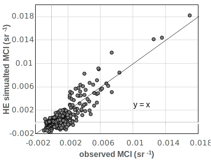

# Intro
this repository includes some water-and-light interaction related algorithm implementation.
## 1. Rrs simulation from given IOPs
 the implementation of water-leaving raidance (Rrs) simulation as used in: 
		Zeng C, Binding C. The effect of mineral sediments on satellite chlorophyll-a retrievals from line-height algorithms using red and near-infrared bands. Remote Sensing. 2019;11(19). doi:10.3390/rs11192306
It uses a very simplified light and water interactcion empricical model:  Rrs = f \*  bb / (a + bb);  which does not count the impact of wind speed, temperature, etc.
It was implemented in Matlab 2017b licensed to ECCC. should be compatible for versions 2015b and after.
The purpose of this package is for fast computation and analyze the trend with change IOP (e.g., chl concentration); for a more strict simulation, please use HydroLight/Ecolight [Mobley, et al,https://www.sequoiasci.com/product/hydrolight/]

to simulate 
```
>> Rrs=OpenLW_simu_Rrs_from_IOP(0.1:5:20.1,1:10);
====finish Rrs simulation, result written to:OpenLW_simu_Rrs_from_IOP_LELW_chl20_mspm10_cdom0.994.csv====
>> Rrs=OpenLW_simu_Rrs_from_IOP(0.1:5:20.1,1:10,[0.494,0.994],'bAB',false,'bSave',true,'waterIOP','waterIOP_SmithandBaker.txt','IOPname','LakeErie','wavelength',400:100:800);
====finish Rrs simulation, result written to:OpenLW_simu_Rrs_from_IOP_LakeErie_chl20_mspm10_cdom0.994.csv====
>> help OpenLW_simu_Rrs_from_IOP
...
 Input arguments:
 		v_chl,v_cdom,v_mspm: the value list of chlorophyll-a[mg/m^3], cdom[1/m], and mineral content/mspm[g/m^3]; default cdom is: 0.994 (1/m)
 		sDir_IOP:  the directory where the IOP files are stored; default is the "./IOPfiles"
 		IOPname  : the name ID key for a provided IOP set. corresponding to the files in: `./IOPfiles/` folder; default IOP model:" "
 		wavelength: the list of wavelength to simulate the output Rrs; default: [400:5:850] nm
 		bAB: flag to use Chl absorption with model: abs(chl) = A x chl^(1-B) model, otherwise use simpler: abs(chl)= a* x chl   model
        bSave: save the simulation result in current directory, in format: 'OpenLW_simu_Rrs_from_IOP_[%s]_chl[%d]_mspm[%d]_cdom[%f].csv'
 		f:  the emperical value f in formula: Rrs = f *  bb / (a + bb);  default use 0.319 after Jerome et al. (1988). 
 		waterIOP: the file name of water IOP, in the './IOPfiles/'	folder, defualt is: 'waterIOP_sea_water.txt'  for clear fresh water
 
 Output arguments: [Rrs_table,Rrs]
 		Rrs: the water leaving radiance (sr-1); dimensions: N x M; where
             N=length(v_chl)*length(v_mspm)*length(v_cdom),  M=length(wavelength)
        Rrs_table: the table format of Rrs, while add 3 columns at
             beginning for: chl, mspm, and cdom
```
a comparison of Rrs derived from OpenWL and Ecolight on some test data as follows,
  
  


to simulate for line-height water index for a specific sensor, use [p]()
```
>> Simu_water_index    %use all default arguments as MCI index, over OCLI sensor
====finish sensor water index simulation, result written to:./TestData/OpenLW_simu_waterIDX_MCI_of_sensor_OLCI.csv====
>> Simu_water_index('sensor','MERIS','waterIDX','CI')  %same as CI model
====finish sensor water index simulation, result written to:./TestData/OpenLW_simu_waterIDX_CI_of_sensor_MERIS.csv====
>> Simu_water_index('sensor','HYPER','waterIDX','user','designed_bands',[665, 674, 753])  %same as FLH model
====finish sensor water index simulation, result written to:./TestData/OpenLW_simu_waterIDX_user_of_sensor_HYPER.csv====
>> help Simu_water_index
 --------------------------------------------------------------------------------------------------------------------------
 this script applies the Rrs simulation with given water IOPs, over a specific sensor
 it then computes line-height water index, and plot the water index vs pre-defined chl concnetration.
 	 Input arguments:
				v_chl,v_mspm,v_cdom:  vectors of IOPs. 
					defualt: 5:5:100  2:2:20  0.994, respectively
 				wavelength: 			wavelength of simulation, default  400:800 at 1nm resolution
 				bPlot: whether plot the result of water idx after simulation, default is true
 				bLog: whether plot with log(Chl)
				bSave: whether save the integrated bands and water index
 				sensor: sensor selection from list: ['HYPER','OLCI','MSI','MERIS','OCI','VIIRS','OLI','MODIS_Aqua','MODIS_Terra'] for simulation
 				waterIDX: line height water index selection: ['MCI','FLH','CI','user']; if choose 'user' model, then the [left, center,right] bands need to set for "designed_bands"
 				designed_bands: user-defined 3 bands for water index calculation, not used if a waterIDX predefined model is chosen. default is [681 708 753].
 				Band_diff_tor: tolerance of index designed band and satellite band difference, default 20nm
--------------------------------------------------------------------------------------------------------------------------
```
and simulation result of the above 3 examples are:
       
---
## 2. QAA
implemented in python
